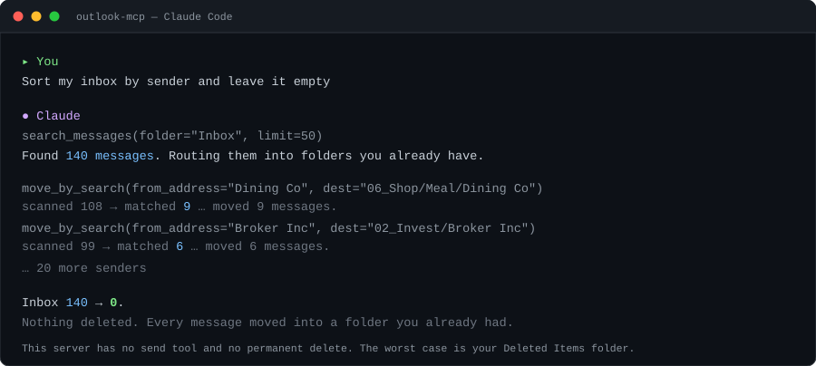
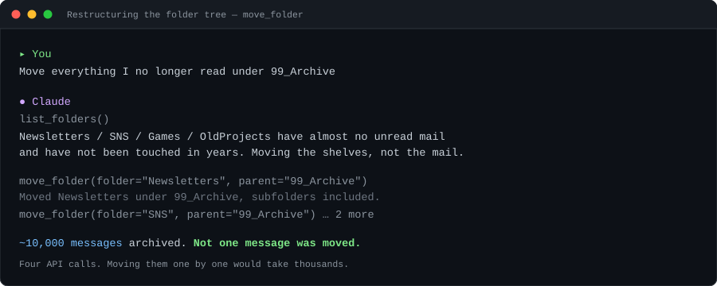

<div align="right">
English | <a href="README.ja.md">日本語</a>
</div>

# outlook-mcp

**An MCP server for cleaning up a large Outlook mailbox — one that cannot send email and cannot permanently delete anything.**

Works with personal Hotmail / Outlook.com accounts as well as work and school accounts, through the Microsoft Graph API.

<p align="center">
  
</p>

---

## Why another Outlook MCP server?

Most Microsoft 365 MCP servers aim for **full coverage** — mail, calendar, contacts, Teams, files — and they can send mail on your behalf. That is a reasonable goal, and if you want it, those servers are a better fit than this one.

This server is scoped to a different job: **triaging and reorganising a mailbox that has decades of mail in it**, with the blast radius reduced on purpose.

| | |
|---|---|
| **Cannot send.** | There is no send, reply, or forward tool, and `Mail.Send` is never requested. Not a flag you can flip — the capability does not exist. |
| **Cannot permanently delete.** | Deletion means "move to Deleted Items". Recoverable, always. |
| **Moves shelves, not mail.** | `move_folder` relocates a whole folder subtree without touching a single message. Reorganising tens of thousands of messages costs a handful of API calls. |
| **Bulk work previews first.** | `move_by_search` and `mark_read_by_search` default to `dry_run=True` and just count. You see the number before anything moves. |
| **Read-only mode.** | `OUTLOOK_READONLY=true` disables every write tool at once. |

It has been exercised on a real mailbox of roughly 40,000 messages: a 270-folder tree collapsed to 9 top-level folders, an inbox of 140 emptied by sender, and 14,617 messages marked read in a single run.

---

## What it can and cannot do

| | |
|---|---|
| ✅ Search | subject, body, sender, date range, unread, folder |
| ✅ Read | message bodies, HTML converted to readable plain text |
| ✅ Organise | move, archive, mark read/unread |
| ✅ Bulk | move or mark read in batches, with a dry run first |
| ✅ Folder surgery | create, rename, move, delete folders |
| ✅ Inbox rules | create server-side rules that keep working when this server is not running |
| ✅ Discard | move to Deleted Items (**recoverable**) |
| ❌ Send | not implemented; `Mail.Send` is never requested |
| ❌ Permanent delete | not implemented, on purpose |
| ❌ Attachments | not implemented (presence is shown with 📎) |

Two delegated permissions are requested: **`Mail.ReadWrite`** and **`MailboxSettings.ReadWrite`** (the latter only for inbox rules).

---

## Setup

**Requirements**: Python 3.10+, a Microsoft account, and Claude Code or another MCP client.

You do two things by hand. Everything else is handled by the agent.

### 1. Register an app in Azure — by hand, once

You need one GUID: an application (client) ID. It is free and does not require an Azure subscription.

This step involves browser sign-in and a consent screen, so do it yourself and read what you are approving — **you are issuing access to your own mailbox**.

→ **[docs/AZURE.en.md](docs/AZURE.en.md)**

It documents two traps that cost real time, both specific to personal Microsoft accounts:
redirect URIs that must exist even though device code flow never visits them, and a permission that
does not take effect until you re-consent.

### 2. Everything else — hand it to Claude Code

Clone the repository, start Claude Code in it, and say:

```
Read docs/SETUP-FOR-CLAUDE.md and set this up
```

The agent creates the virtual environment, installs dependencies, writes `.env`, registers the MCP
server, and verifies the connection. It stops once and asks you to run `login.py` yourself, because
device code flow needs a browser and cannot be completed by an agent.

> **That runbook is written in Japanese.** That is fine — the reader is an agent, and Claude follows
> it without trouble. If you would rather read it yourself, the [manual steps](README.ja.md#セットアップ)
> are short.

---

## Tools

| Tool | Kind | What it does |
|---|---|---|
| `check_config` | read | diagnose configuration, auth and connectivity |
| `list_folders` | read | folder tree with item and unread counts |
| `search_messages` | read | search by keyword, sender, date range, unread, folder |
| `get_message` | read | one message body and recipients |
| `list_rules` | read | existing inbox rules |
| `create_folder` | write | create a folder |
| `rename_folder` | write | rename a folder, contents untouched |
| `move_folder` | write | move a folder under a new parent, subtree included |
| `move_messages` | write | move up to 25 messages |
| `move_by_search` | write | move everything matching a query, up to 2,000 |
| `mark_messages_read` | write | toggle read/unread, up to 25 |
| `mark_read_by_search` | write | mark everything matching a query, up to 25,000 |
| `archive_messages` | write | move to Archive |
| `create_rule` | write | create a server-side inbox rule |
| `move_to_trash` | destructive | move to Deleted Items (recoverable) |
| `delete_folder` | destructive | delete a folder (`force` required if not empty) |
| `delete_rule` | destructive | delete an inbox rule (messages untouched) |

### Moving shelves instead of mail



`move_folder` changes a folder's parent. Messages stay where they are, keep their IDs, and the inbox
rules that point at that folder keep working — Graph preserves folder IDs across renames and moves.
Doing the same thing message by message would mean hundreds of calls and would invalidate every ID.

### Bulk operations

Batched 20 at a time through the Graph `/$batch` endpoint, with **per-item status checks**. A batch can
return HTTP 200 overall while individual entries fail — treating the batch as all-or-nothing would mean
reprocessing thousands of messages because a handful got throttled. Re-running picks up only what failed.

```
move_by_search(dest="99_Archive", folder="Newsletters")
  → scanned 6,000 → matched 6,000
    [dry run — nothing moved yet]

move_by_search(dest="99_Archive", folder="Newsletters", dry_run=False)
  → moved 6,000 messages to 99_Archive.
```

`move_by_search` refuses calls with no filter at all, so "move the entire mailbox" cannot happen by
accident. `mark_read_by_search` allows it, since marking read does not relocate anything — but it warns
that read state is not recoverable.

---

## Known limits

- **Keyword search and strict date ordering are mutually exclusive.** Graph does not allow `$search`
  together with `$filter`/`$orderby`. With a keyword the server fetches up to 100 relevance-ranked
  results and re-sorts them locally; without one it uses `$filter` + `$orderby` for true date order.
  When more than 100 match, the response says so.
- **`since` / `until` are UTC.** For a strict local-time day, fetch a wider window and narrow locally.
- **Folder listing stops at three levels.** Deeper folders are not listed, though operations on them work.
- **Large runs can be throttled.** Items that fail with `MailboxConcurrency limit` are reported; re-run
  the same call to process the remainder.

---

## Development

```bash
.venv/bin/pip install pytest
.venv/bin/pytest -q              # unit tests
.venv/bin/python smoke_test.py   # stdio smoke test
```

Neither connects to Microsoft Graph or touches a mailbox, and neither needs credentials. The smoke test
starts the server over stdio and checks what an MCP client actually sees: the tool list, input schemas,
`destructive_hint` annotations, and that failures come back as readable guidance rather than tracebacks.

Details and evidence: **[docs/TEST.md](docs/TEST.md)** (Japanese).

---

## Documentation

| | Audience | Contents |
|---|---|---|
| This file | humans | overview, positioning, tools, limits |
| [README.ja.md](README.ja.md) | humans | the full version — use cases, design rationale, detailed notes |
| [docs/AZURE.en.md](docs/AZURE.en.md) | humans | Azure app registration, the only manual step |
| [docs/SETUP-FOR-CLAUDE.md](docs/SETUP-FOR-CLAUDE.md) | **agents** | setup runbook, written to be read by Claude Code |
| [docs/TEST.md](docs/TEST.md) | humans | test inventory and evidence (Japanese) |

The Japanese README is the fuller document. This one is deliberately kept short so the two do not drift.

---

## License

MIT
